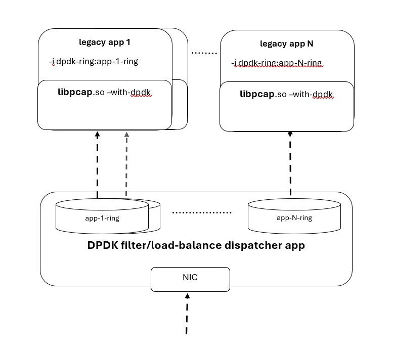

# dpdk-ring interface

dpdk-ring interface allows any app that already receives packets via libpcap to interconnect with dpdk apps.
Such app only needs to link to libpcap compiled with-dpdk instead of writing dedicated complex dpdk code.
IPC using dpdk ring is way more efficient then going thru the linux network stack.

The dpdk app should run as primary dpdk process and create ring(s).  
The non-dpdk app(s) should run as secondary dpdk process using libpcap to listen on that ring(s).



## HOWTO

1.	Build libpcap with dpdk
```
configure --with-pcap=dpdk && make
```

2. Link the non-dpdk app to the libpcap with dpdk support

3. To receive from primary DPDK process ring use `-i dpdk-ring:<ring-name>` with the ring name, such as `dpdk-ring:net_ring0`  
DPDK_CFG environment variable should be used to set the DPDK EAL parameters.  
The app shall run as a secondary dpdk process using `--proc-type=secondary` to connect to a ring the primary dpdk process created.  

## Example
If dpdk-testpmd is used as primary process to forwards traffic to capturetest it could be launched by:

```
dpdk-testpmd -v --proc-type=primary -l 0,1 -a 0000:05:00.0 --vdev=net_ring0 -- -i --auto-start

DPDK_CFG="-v --proc-type=secondary -l 2" capturetest -i  dpdk-ring:ETH_RXTX0_net_ring0
```
(`--vdev=net_ring` implicitly adds ETH_RXTX<qid> prefix to the ring name)
